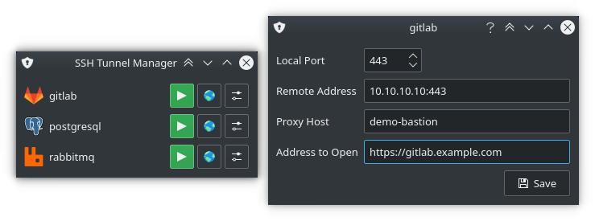

# SSH Tunnel Manager

A PyQt GUI to manage SSH tunnels



## Usage

* Install dependencies: `pip3 install PyQt5`
* Create a config: `cp config.json.example config.json`
* Run the app: `python3 app.py`
* You can modify `sshtunnelmgr.desktop` and put in `~/.local/share/application` to create a app menu shortcut

## Configuration

A sample configuration file provide as `config.json.example`. Here is one sample host entry.

```json
{
  "bar": {
    "remote_address": "172.17.0.100:5555",
    "local_address": "127.0.0.1:5555",
    "proxy_host": "dummy-proxy-host",
    "browser_open": "http://127.0.0.1:5555"
  }
}
```

This entry, when clicked `Start`, will run the following SSH command to establish the tunnel.

```
ssh -L 127.0.0.1:5555:172.17.0.100:5555 dummy-proxy-host
```

The key `browser_open` is optional. If provided, it will open the provided URL in the system's default web browser.

The application saves the tunnel information into a `dict` and can `kill` it when the `Stop` button is clicked.

> (Unsafe) To allow SSH to bind on privileged ports, run this `sudo setcap CAP_NET_BIND_SERVICE=+eip /usr/bin/ssh`

## TODO

* Gracefully close SSH session instead of `kill`
* Allow adding/editing/deleting hosts using the GUI
* Store the config in `QSettings` instead of local JSON file
